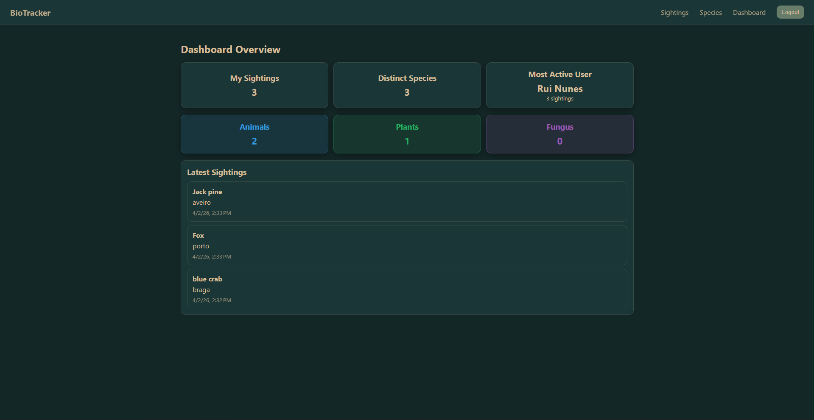
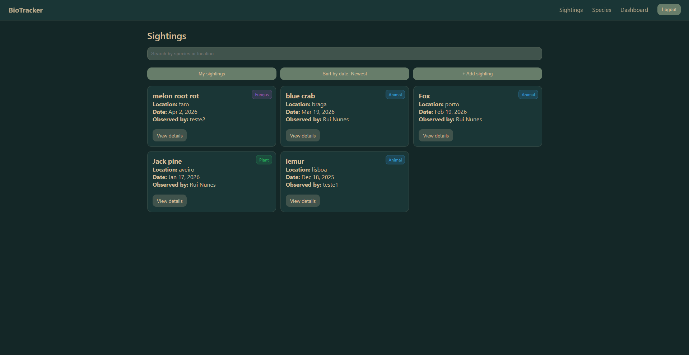

# BioTracker — Local Biodiversity Platform

## Description
BioTracker is a full-stack web application that enables users to record, explore, and analyse local biodiversity observations. Users can register sightings of animals, plants, and fungi, contributing to a collaborative dataset that helps build a regional biodiversity atlas. The platform includes authentication, filtering, and a dashboard with statistics.

---

## Sustainable Development Goal (ODS 15 — Life on Land)
This project contributes to **ODS 15 — Life on Land** by promoting citizen participation in biodiversity monitoring. By allowing users to record structured observations of species, BioTracker helps increase environmental awareness and supports data collection for conservation efforts.

---

## Application Preview

### Dashboard


### Sightings


---

## 🛠 Tech Stack

| Layer        | Technology                         |
|-------------|----------------------------------|
| Frontend     | Angular (TypeScript)             |
| Backend      | Node.js + Express                |
| Database     | Supabase (PostgreSQL)            |
| Auth         | Supabase Auth (JWT)              |
| CI/CD        | GitHub Actions                   |
| Deployment   | Vercel (frontend) + Render (backend) |
| DevOps       | Docker + Docker Compose          |

---

## Live Application

- Frontend: https://bio-tracker-1jb6nz7vu-ruirbnunes-8715s-projects.vercel.app  
- Backend: https://bio-tracker-viq9.onrender.com  

---

## Project Structure

```plaintext
projeto-final/
├── frontend/
│   └── src/
│       ├── app/
│       │   ├── core/
│       │   │   ├── services/
│       │   │   ├── interceptors/
│       │   │   └── guards/
│       │   │
│       │   ├── shared/
│       │   │   ├── components/
│       │   │   └── models/
│       │   │
│       │   └── features/
│       │       ├── auth/
│       │       ├── sightings/
│       │       ├── species/
│       │       └── dashboard/
│       │
│       └── main.ts
│
├── backend/
│   └── src/
│       ├── controllers/
│       ├── routes/
│       ├── middleware/
│       ├── utils/
│       ├── types/
│       └── supabaseClient.ts
│
├── docker-compose.yml
└── README.md
```

---

## Environment Variables

Create a `.env` file (use `.env.example` as reference):

```env
# Backend (Supabase)
SUPABASE_URL=your_supabase_url
SUPABASE_SERVICE_ROLE_KEY=your_service_role_key

# Frontend
API_URL=http://localhost:3000
FRONTEND_URL=http://localhost:4200
```

---

## Running the Project Locally

### Prerequisites
Make sure you have installed:
- Node.js (LTS recommended)
- npm
- Docker & Docker Compose (if using Docker)

---

## Environment Setup

Before running the project, create the required `.env` files using `.env.example` as reference.

### Backend (`/backend/.env`)
```env
SUPABASE_URL=your_supabase_url
SUPABASE_SERVICE_ROLE_KEY=your_service_role_key
```

### Frontend (`/frontend/.env` if applicable)
```env
API_URL=http://localhost:3000
FRONTEND_URL=http://localhost:4200
```

---

## Option 1 — Using Docker (recommended)

This is the easiest way to run the full stack application.

```bash
git clone https://github.com/ruirnunes/BioTracker.git
cd BioTracker
docker compose up --build
```

Once running, access:
- Frontend → http://localhost:4200  
- Backend → http://localhost:3000  

---

## Option 2 — Without Docker (manual setup)

### 1. Start Backend

```bash
cd backend
npm install
npm run dev
```

Backend runs on:
- http://localhost:3000

---

### 2. Start Frontend

Open a new terminal:

```bash
cd frontend
npm install
ng serve
```

Frontend runs on:
- http://localhost:4200

---

## Important Notes

- Backend must be running before using the frontend
- Ensure Supabase credentials are correctly configured
- If ports are in use, adjust them in environment configuration

---

## Features Implemented

### Authentication
- User authentication (register / login via Supabase Auth)
- JWT-based session handling
- Protected routes (frontend guards)
- HTTP interceptor for authenticated requests

---

### Sightings Management (CRUD)
- Create new biodiversity sightings
- List all sightings
- View sighting details
- Update sightings
- Delete sightings

---

### Search & Filtering
- Filter sightings by species or keyword
- User-specific sightings view
- Sort sightings by date

---

### Species Module
- List all species
- View species details
- Create and manage species records

---

### Dashboard & Statistics
- Total sightings
- Distinct species count
- Sightings grouped by type (animal / plant / fungus)
- Most active user
- Latest sightings feed

---

## API Endpoints

### Authentication
- `POST /auth/register`
- `POST /auth/login`

---

### Sightings (CRUD)
- `POST /sightings`
- `GET /sightings`
- `GET /sightings/:id`
- `PUT /sightings/:id`
- `DELETE /sightings/:id`

---

### Species
- `POST /species`
- `GET /species`
- `GET /species/:id`
- `PUT /species/:id`
- `DELETE /species/:id`

---

### User
- `GET /users/me`
- `PUT /users/me`

---

### Statistics
- `GET /users/me/stats`
- `GET /sightings/stats`

---

## Database (Supabase)

### Table: `species`

| Field        | Type                          | Description                     |
|-------------|-------------------------------|--------------------------------|
| id          | UUID (PK)                     | Unique identifier              |
| common_name | TEXT                          | Common species name           |
| genus       | TEXT                          | Genus                         |
| species     | TEXT                          | Species name                  |
| type        | TEXT (animal/plant/fungus)    | Biological classification     |
| image_url   | TEXT                          | Optional image URL            |
| created_at  | TIMESTAMP                     | Auto-generated               |

---

### Table: `sightings`

| Field        | Type        | Description                          |
|-------------|------------|--------------------------------------|
| id          | UUID (PK)  | Unique identifier                    |
| user_id     | UUID       | Reference to user                   |
| species_id  | UUID       | Reference to species                |
| location    | TEXT       | Observation location               |
| date        | DATE       | Observation date                   |
| image_url   | TEXT       | Optional image URL                 |
| created_at  | TIMESTAMP  | Auto-generated                    |

---

## CI/CD

This project uses GitHub Actions for:
- Linting
- Build validation
- Continuous integration
- Automatic deployment

---

## Design Decision

A **separated frontend/backend architecture** was chosen to improve scalability and maintainability.

- Angular handles the UI and client-side logic  
- Node.js provides a REST API  
- Supabase manages the database and authentication  

This separation allows independent deployment, better modularity, and easier future expansion (e.g. mobile app or microservices).

---

## Current Status

✔ Authentication system implemented (Supabase Auth)  
✔ Full CRUD for sightings  
✔ Species management module implemented  
✔ User management and profile endpoints  
✔ Dashboard with biodiversity statistics  
✔ Filtering and sorting (species, user, date)  
✔ Database fully integrated (Supabase PostgreSQL)  
✔ Frontend and backend successfully connected  
✔ Docker environment configured  
✔ Deployment completed (Frontend: Vercel | Backend: Render)

---

## License

This project is for educational purposes.

---

## Author
Rui Nunes